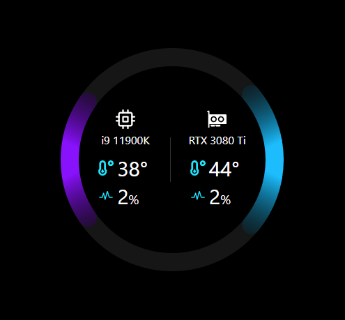
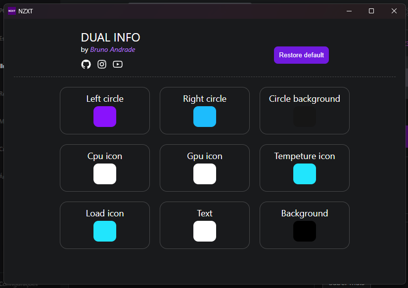

# NZXT

[Web integrations](https://developer.nzxt.com/) for the NZXT Kraken series.

An integration to monitor CPU and GPU information (load and temperature) with web technologies using NZXT web integrations API.

# Use in Kraken web integration

URL: https://brunoandradebr.github.io/nzxt/

# Preview

# Fully customizable

# How to run

install dependencies  
`yarn`  
run locally  
`yarn dev`

# Technologies

- Vite
- React
- Styled-components
- Typescript
- Zustand
